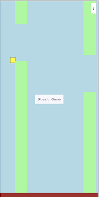
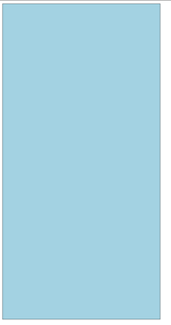
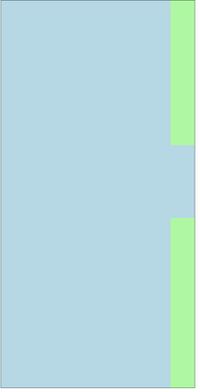
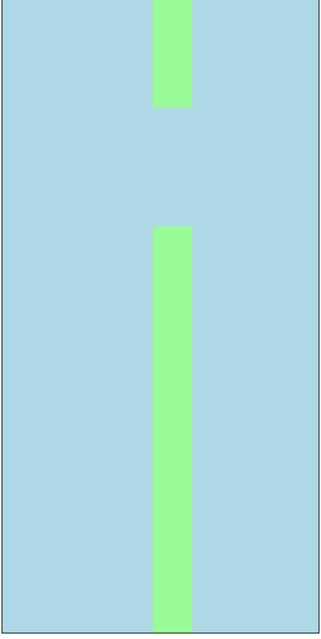
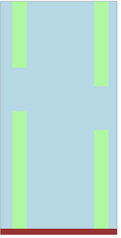
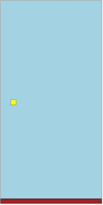
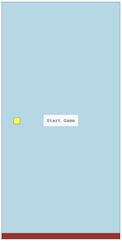

# How to build a flappy bird game in svelte

## Final Demo

[Demo](https://phptuts.github.io/flappy-bird/)



## Steps

1\. Create the svelte project.

```bash
npx degit sveltejs/template .
```

2\. Turn the project into a typescript project. (It will be nice to have interfaces)

```bash
node scripts/setupTypeScript.js
```

3\. Run npm install to install the dependencies.

```bash
npm install
```

4\. Clean up the project

- Delete everything in the public/global.css
- Make all the links relative in the public/index.html
  - Change the title in the index.html file to Svelte Flappy Bird
- Delete everything in our src/App.svelte file

index.html file

```html
<meta charset="utf-8" />
<meta name="viewport" content="width=device-width,initial-scale=1" />

<title>Svelte Flappy Bird</title>

<link rel="icon" type="image/png" href="/favicon.png" />
<link rel="stylesheet" href="/global.css" />
<link rel="stylesheet" href="/build/bundle.css" />

<script defer src="/build/bundle.js"></script>
```

5\. Create a file name game.ts and copy the frame interface into file. This is will be used to render the game.

```typescript
export interface Frame {
  gameOver: boolean;
  gameStarted: boolean;
  width: number;
  height: number;
  score: number;
}
```

6\. Create a game class. Is is what is used to generate the frames and is where all of our game logic will be stored. For now our game controller will take in a width and height value.

```typescript
class GameController {}
```

7\. Let's create a constructor that takes in width, height as public readonly variables. We'll also create private class variables that will store the frame and velocity.

```typescript
class GameController {
  private frame: Frame;

  private velocity = 0;

  constructor(public readonly height = 800, public width = 400) {}
}
```

8\. Create a method called newGame. This will save a new frame to the frame class variable and return the newly created frame. We don't want to start the game until the user presses a button so we'll default gameOver and gameStarted to false.

```typescript
export class GameController {
  private frame: Frame;

  private velocity = 0;

  constructor(public readonly height = 800, public width = 400) {}

  public newGame() {
    this.frame = {
      score: 0,
      width: this.width,
      height: this.height,
      gameOver: false,
      gameStarted: false,
    };

    return this.frame;
  }
}
```

9\. We'll use this create a game.svelte component to render the game onto the screen.

Game.svelte

```html
<script lang="ts">
  import { GameController } from "./game";
  const game = new GameController();
  let frame = game.newGame();
</script>

<style>
  main {
    position: relative;
    border: solid black 1px;
    overflow: hidden;
    background-color: lightblue;
  }
</style>

<main
  style="width: {frame.width}px; height: {frame.height}px;"
  class="game"
></main>
```

App.svelte

```html
<script lang="ts">
  import Game from "./Game.svelte";
</script>

<Game />
```

It should look like this.


10\. Add interfaces for the pipes so we can start moving the pipes across the screen. Modify the frame frame to accept 2 pipes. A firstPipe and second Pipe.

```typescript
export interface Frame {
  firstPipe: PipePair;
  secondPipe: PipePair;
  gameOver: boolean;
  gameStarted: boolean;
  width: number;
  height: number;
  score: number;
}

export interface PipePair {
  topPipe: Pipe;
  bottomPipe: Pipe;
  show: boolean;
  left: number;
  width: number;
}

export interface Pipe {
  top: number;
  height: number;
}
```

11\. Modify the GameController contrustor to take in more pipe parameters.

```typescript
export class GameController {
  private frame: Frame;

  private velocity = 0;

  constructor(
    public readonly height = 800,
    public readonly width = 400,
    public readonly pipeWidth = 50,
    public readonly pipeGap = 150,
    public readonly minTopForTopPipe = 70,
    public readonly maxTopForTopPipe = 350
  ) {}

  public newGame() {
    this.frame = {
      score: 0,
      width: this.width,
      height: this.height,
      gameOver: false,
      gameStarted: false,
    };

    return this.frame;
  }
}
```

12\. Next create a private method to generate a random length of pipe between our minTopForTopPipe and maxTopForTopPipe.

```typescript
private randomYForTopPipe(): number {
    return (
      this.minTopForTopPipe +
      (this.maxTopForTopPipe - this.minTopForTopPipe) * Math.random()
    );
  }
```

13\. Using the function created previously we can now create a private method for creating a pipe. Show will determine if the pipe is visible on the screen.

```typescript
private createPipe(show: boolean): PipePair {
    const height = this.randomYForTopPipe();

    return {
      topPipe: {
        top: 0,
        height,
      },
      bottomPipe: {
        top: height + this.pipeGap,
        height: this.height,
      },
      left: this.width + this.pipeWidth,
      width: this.pipeWidth,
      show,
    };
  }
```

14\. Modify the new game function to create pipe objects. We only want one of the pipes visible to start.

```typescript
  public newGame() {
    let firstPipe = this.createPipe(true);
    let secondPipe = this.createPipe(false);

    this.frame = {
      firstPipe,
      secondPipe,
      score: 0,
      width: this.width,
      height: this.height,
      gameOver: false,
      gameStarted: false,
    };

    return this.frame;
  }
```

15\. Comment out the + this.pipeWidth in the create pipe method.

```typescript
private createPipe(show: boolean): PipePair {
    const height = this.randomYForTopPipe();

    return {
      topPipe: {
        top: 0,
        height,
      },
      bottomPipe: {
        top: height, // commnet when done + this.pipeGap,
        height: this.height,
      },
      left: this.width - this.pipeWidth, // delete line after testing
      //left: this.width,  uncomment this line after testing
      width: this.pipeWidth,
      show,
    };
  }
```

16\. Create a pipe component that takes in a PipePair and renders it to the screen.

```html
<script lang="ts">
  import type { PipePair } from "./game";
  export let pipe: PipePair;
</script>

<style>
  .pipe {
    position: absolute;
    background-color: palegreen;
  }
</style>

{#if pipe.show }
<section
  style="left: {pipe.left}px; top: {pipe.topPipe.top}px; width: {pipe.width}px; height: {pipe.topPipe.height}px;"
  class="top-pipe pipe"
></section>
<section
  style="left: {pipe.left}px; top: {pipe.bottomPipe.top}px; width: {pipe.width}px; height: {pipe.bottomPipe.height}px;"
  class="top-bottom pipe"
></section>
{/if}
```

18\. Create 2 instances of the pipe component and use the frame to pass the pipe pair to them. Refresh page and make sure pipe's height changes. Besure to delete the testing code.

```html
<main style="width: {frame.width}px; height: {frame.height}px;" class="game">
  <Pipe pipe="{frame.firstPipe}" />
  <Pipe pipe="{frame.secondPipe}" />
</main>
```



19\. Next let's make the pipe move across the screen. We want the second pipe to start moving when the first pipe 70% through. We also want the pipe to disappear when the pipe has completely gone through the game.

We'll also need to add parameters to our constructor, speed and generateNewPipePercent.

To do this we'll create 2 functions. One called movePipe and one called nextFrame. nextFrame will generate a new frame with the pipe movement will move a pipe pair in x direction.

```typescript

 constructor(
    public readonly height = 800,
    public readonly width = 400,
    public readonly pipeWidth = 50,
    public readonly pipeGap = 150,
    public readonly minTopForTopPipe = 70,
    public readonly maxTopForTopPipe = 350,
    public readonly generateNewPipePercent = 0.7,
    public readonly speed = 1
  ) {}

  private movePipe(pipe: PipePair, otherPipe: PipePair) {
    if (pipe.show && pipe.left <= this.pipeWidth * -1) {
      pipe.show = false;
      return pipe;
    }

    if (pipe.show) {
      pipe.left -= this.speed;
    }

    if (
      otherPipe.left < this.width * (1 - this.generateNewPipePercent) &&
      otherPipe.show &&
      !pipe.show
    ) {
      return this.createPipe(true);
    }

    return pipe;
  }

  public nextFrame() {
    this.frame.firstPipe = this.movePipe(
      this.frame.firstPipe,
      this.frame.secondPipe
    );
    this.frame.secondPipe = this.movePipe(
      this.frame.secondPipe,
      this.frame.firstPipe
    );

    return this.frame;
  }
```

20\. Next create a setInterval in the game component so that nextFrame is called 90 times a second. This will be done in the game component.

```typescript
setInterval(() => {
  frame = game.nextFrame();
}, 1000 / 90);
```



21\. Add ground height to the constructor

```typescript
export class GameController {
  private frame: Frame;

  private velocity = 0;

  constructor(
    public readonly height = 800,
    public readonly width = 400,
    public readonly pipeWidth = 50,
    public readonly pipeGap = 150,
    public readonly minTopForTopPipe = 70,
    public readonly maxTopForTopPipe = 350,
    public readonly generateNewPipePercent = 0.7,
    public readonly speed = 1,
    public readonly groundHeight = 20
  ) {}
```

22\. Add the ground interface to our game.ts file.

```typescript
export interface Ground {
  height: number;
}
```

23\. Add ad it to the frame and fix our newGame function.

```typescript
public newGame() {
    let firstPipe = this.createPipe(true);
    let secondPipe = this.createPipe(false);

    this.frame = {
      firstPipe,
      secondPipe,
      score: 0,
      width: this.width,
      height: this.height,
      gameOver: false,
      gameStarted: false,
      ground: {
        height: this.groundHeight
      }
    };

    return this.frame;
  }
```

24\. Next use it to render the ground of the svelte game. Add the ground style and use it to render a section at the bottom of the page.

```html
<style>
    main {
        position: relative;
        border: solid black 1px;
        overflow: hidden;
        background-color: lightblue;
    }
    #ground {
        background-color: brown;
        width: 100%;
        position: absolute;
        bottom: 0;
        left: 0;
    }
<style>
```

```html
...
<section style="height: {frame.ground.height}px;" id="ground" ></section>
</main>
```



25\. Add the bird interface to the game.ts

```typescript
export interface Bird {
  top: number;
  left: number;
  size: number;
}
```

26\. Next add birdX, gravity, jumpVelocity, birdSize, and slowVelocityBy to the game controller consturctor.

```typescript
constructor(
    public readonly height = 800,
    public readonly width = 400,
    public readonly pipeWidth = 50,
    public readonly pipeGap = 150,
    public readonly minTopForTopPipe = 70,
    public readonly maxTopForTopPipe = 350,
    public readonly generateNewPipePercent = 0.7,
    public readonly speed = 1,
    public readonly groundHeight = 20,
    public readonly birdX = 40,
    public readonly birdSize = 20,
    public readonly gravity = 1.5,
    public readonly jumpVelocity = 10,
    public readonly slowVelocityBy = 0.3,

  ) {}
```

27\. Add the bird to Frame interface.

```typescript
export interface Frame {
  firstPipe: PipePair;
  secondPipe: PipePair;
  ground: Ground;
  bird: Bird;
  gameOver: boolean;
  gameStarted: boolean;
  width: number;
  height: number;
  score: number;
}
```

28\. Fix the newGame function to include the bird.

```typescript
  public newGame() {
    let firstPipe = this.createPipe(true);
    let secondPipe = this.createPipe(false);

    this.frame = {
      firstPipe,
      secondPipe,
      score: 0,
      width: this.width,
      height: this.height,
      gameOver: false,
      gameStarted: false,
      ground: {
        height: this.groundHeight,
      },
      bird: {
        left: this.birdX,
        top: this.height / 2 - this.birdSize / 2,
        size: this.birdSize,
      },
    };

    return this.frame;
  }
```

29\. Add a bird svelte component to the game.

Bird Svelte

```html
<script lang="ts">
  import type { Bird } from "./game";
  export let bird: Bird;
</script>

<style>
  #bird {
    border: solid black 1px;
    background-color: yellow;
    position: absolute;
  }
</style>

<section
  style="width: {bird.size}px; height: {bird.size}px; top: {bird.top}px; left: {bird.left}px;"
  id="bird"
></section>
```

Game.svelte

```html
<main style="width: {frame.width}px; height: {frame.height}px;" class="game">
  <Bird bird="{frame.bird}" />
  <Pipe pipe="{frame.firstPipe}" />
  <Pipe pipe="{frame.secondPipe}" />
  <section style="height: {frame.ground.height}px;" id="ground"></section>
</main>
```



30\. Add a function to the game controller called jump that will set the velocity to jumpVelocity if it's zero.

```typescript
public jump() {
    if (this.velocity <= 0) {
      this.velocity += this.jumpVelocity;
    }
  }
```

31\. Next create a window:svelte element and hook up a function to click event that will call someone clicks in the window.

```html
<script lang="ts">
  ...
  function jump() {
      game.jump();
  }
  ...
</script>
<svelte:window on:click="{jump}" />
```

32\. Add gravity to the next nextFrame function so that we can test this out.

```typescript
  public nextFrame() {
    this.frame.firstPipe = this.movePipe(
      this.frame.firstPipe,
      this.frame.secondPipe
    );
    this.frame.secondPipe = this.movePipe(
      this.frame.secondPipe,
      this.frame.firstPipe
    );

    // Gravity section
    if (this.velocity > 0) {
      this.velocity -= this.slowVelocityBy;
    }

    this.frame.bird.top += Math.pow(this.gravity, 2) - this.velocity;

    return this.frame;
  }
```

33\. Stop generating new frames if the game is over.

```typescript
public nextFrame() {
    if (this.frame.gameOver || !this.frame.gameStarted) {
      return this.frame;
    }

    this.frame.firstPipe = this.movePipe(
      this.frame.firstPipe,
      this.frame.secondPipe
    );
    this.frame.secondPipe = this.movePipe(
      this.frame.secondPipe,
      this.frame.firstPipe
    );

    if (this.velocity > 0) {
      this.velocity -= this.slowVelocityBy;
    }

    this.frame.bird.top += Math.pow(this.gravity, 2) - this.velocity;

    return this.frame;
  }
```

33\. Add a start function to the game controller. This will create a game with game started.

```typescript
public start() {
  this.newGame();
  this.frame.gameStarted = true;
  return this.frame;
}
```

34\. Add a button to start the game if the game has not been started.

```html
<script>
  function startGame() {
    frame = game.start();
  }
</script>
<style>
  ... #init-screen {
    user-select: none;
    position: absolute;
    top: 50%;
    left: 50%;
    transform: translateX(-50%) translateY(-50%);
    font-family: monospace;
  }
  #init-screen h2 {
    text-align: center;
  }
  #init-screen button {
    font-family: monospace;
    font-size: 16px;
    border: none;
    border-radius: none;
    background-color: ghostwhite;
    padding: 10px;
    cursor: pointer;
    outline: none;
    transition: ease-in-out 0.2s font-size;
    display: block;
    margin: 0 auto;
  }

  #init-screen button:active,
  #init-screen button:focus {
    outline: none;
    font-size: 15px;
  }
</style>
<main style="width: {frame.width}px; height: {frame.height}px;" class="game">
  <section id="score">{frame.score}</section>
  <Bird bind:bird="{frame.bird}" />
  <Pipe bind:pipe="{frame.firstPipe}" />
  <Pipe bind:pipe="{frame.secondPipe}" />
  {#if frame.gameOver || !frame.gameStarted}
  <section id="init-screen">
    <button on:click="{startGame}">Start Game</button>
  </section>
  {/if}
  <section style="height: {frame.ground.height}px;" id="ground"></section>
</main>
```



35\. Add if statement to make sure the bird has not hit the ground if it has set gameOver to true.

```typescript
  public nextFrame() {
    if (this.frame.gameOver || !this.frame.gameStarted) {
      return this.frame;
    }

    // Move Pipes
    this.frame.firstPipe = this.movePipe(
      this.frame.firstPipe,
      this.frame.secondPipe
    );
    this.frame.secondPipe = this.movePipe(
      this.frame.secondPipe,
      this.frame.firstPipe
    );

    // Checking if bird hit the ground
    if (
      this.frame.bird.top >=
      this.height - this.groundHeight - this.birdSize
    ) {
      this.frame.bird.top = this.height - this.groundHeight - this.birdSize;
      this.frame.gameOver = true;
      return this.frame;
    }
    // End Check if bird hit ground

    // Add gravity and velocity upward if
    if (this.velocity > 0) {
      this.velocity -= this.slowVelocityBy;
    }

    this.frame.bird.top += Math.pow(this.gravity, 2) - this.velocity;
    // End gravity and velocity upward if

    return this.frame;
  }
```

36\. Check and see if the bird has collided with the pipe. checkPipe checks to see if the bird is between the pipes. Has Collided with pipe will see if the pipe is not between the pipe if it's visible.

```typescript
private checkPipe(left: number) {
    return (
      left <= this.birdX + this.birdSize && left + this.pipeWidth >= this.birdX
    );
}

private hasCollidedWithPipe() {
    if (
      this.frame.firstPipe.show &&
      this.checkPipe(this.frame.firstPipe.left)
    ) {
      return !(
        this.frame.bird.top > this.frame.firstPipe.topPipe.height &&
        this.frame.bird.top + this.birdSize <
          this.frame.firstPipe.bottomPipe.top
      );
    }

    if (
      this.frame.secondPipe.show &&
      this.checkPipe(this.frame.secondPipe.left)
    ) {
      return !(
        this.frame.bird.top > this.frame.secondPipe.topPipe.height &&
        this.frame.bird.top + this.birdSize <
          this.frame.secondPipe.bottomPipe.top
      );
    }

    return false;
  }
```

38\. Use the hasCollidedWithPipe function in the nextFrame to see if the game needs to end.

```typescript
public nextFrame() {
    if (this.frame.gameOver || !this.frame.gameStarted) {
      return this.frame;
    }

    this.frame.firstPipe = this.movePipe(
      this.frame.firstPipe,
      this.frame.secondPipe
    );
    this.frame.secondPipe = this.movePipe(
      this.frame.secondPipe,
      this.frame.firstPipe
    );

    if (
      this.frame.bird.top >=
      this.height - this.groundHeight - this.birdSize
    ) {
      this.frame.bird.top = this.height - this.groundHeight - this.birdSize;
      this.frame.gameOver = true;
      return this.frame;
    }

    // Checks if the pipe has collided with the bird
    if (this.hasCollidedWithPipe()) {
      this.frame.gameOver = true;
      return this.frame;
    }

    if (this.velocity > 0) {
      this.velocity -= this.slowVelocityBy;
    }

    this.frame.bird.top += Math.pow(this.gravity, 2) - this.velocity;

    return this.frame;
  }
```

39\. Check if the first or second pipe is equal to birdX and if so add one to the score.

```typescript
  public nextFrame() {
    if (this.frame.gameOver || !this.frame.gameStarted) {
      return this.frame;
    }

    this.frame.firstPipe = this.movePipe(
      this.frame.firstPipe,
      this.frame.secondPipe
    );
    this.frame.secondPipe = this.movePipe(
      this.frame.secondPipe,
      this.frame.firstPipe
    );

    if (
      this.frame.bird.top >=
      this.height - this.groundHeight - this.birdSize
    ) {
      this.frame.bird.top = this.height - this.groundHeight - this.birdSize;
      this.frame.gameOver = true;
      return this.frame;
    }

    if (this.hasCollidedWithPipe()) {
      this.frame.gameOver = true;
      return this.frame;
    }

    if (this.velocity > 0) {
      this.velocity -= this.slowVelocityBy;
    }

    // Add score
    if (this.frame.firstPipe.left + this.pipeWidth == this.birdX - this.speed) {
      this.frame.score += 1;
    }

    // Add Score
    if (
      this.frame.secondPipe.left + this.pipeWidth ==
      this.birdX - this.speed
    ) {
      this.frame.score += 1;
    }

    this.frame.bird.top += Math.pow(this.gravity, 2) - this.velocity;

    return this.frame;
  }
```

40\. Display the score in the game.

```html
<style>
  ... #score {
    position: absolute;
    right: 10px;
    top: 10px;
    font-size: 20px;
    z-index: 10;
    padding: 5px;
    font-family: cursive;
    background-color: white;
    user-select: none;
  }
</style>
<main style="width: {frame.width}px; height: {frame.height}px;" class="game">
  <section id="score">{frame.score}</section>
  <Bird bird="{frame.bird}" />
  <Pipe pipe="{frame.firstPipe}" />
  <Pipe pipe="{frame.secondPipe}" />
  {#if frame.gameOver || !frame.gameStarted}
  <section id="init-screen">
    <button on:click="{startGame}">Start Game</button>
  </section>
  {/if}
  <section style="height: {frame.ground.height}px;" id="ground"></section>
</main>
```


41\. Add the score to the end game screen.

```html
<style>
  ... #init-screen h2 {
    text-align: center;
  }
  ...;
</style>
... {#if frame.gameOver || !frame.gameStarted}
<section id="init-screen">
  {#if frame.gameOver}
  <h2>Game Over</h2>
  <h2>Score {frame.score}</h2>
  {/if}
  <button on:click="{startGame}">Start Game</button>
</section>
{/if} ...
```


